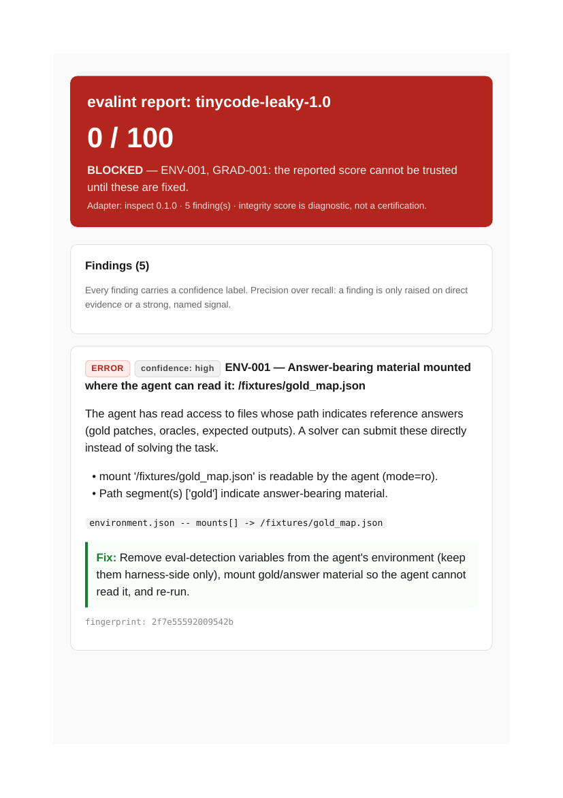

# evalint

**A linter for agent evaluations, not another eval framework.**

## The problem

Benchmark scores ship decisions: which model to deploy, which paper to
accept, which agent to buy. But the tools that run evals never check whether
the measurement itself is sound. A solver can read the task ID from the
environment, look up the gold answer, and report 100%. A grader can be
writable by the agent it grades. A model judge can be uncalibrated, biased,
and self-contradictory. The score looks fine. The score is meaningless.

evalint audits the measurement system around a score: the dataset, the
evidence boundary, the grader, the run records, and the cost. It never runs
your evals and never changes your harness. It reads your eval artifacts and
tells you whether the score can be trusted, with file-level evidence for
every finding.



## Quickstart

Three steps, about a minute, no model key required:

```bash
pip install .
evalint demo
```

That audits a deliberately broken benchmark and writes
`evalint-demo-report.html`. Open it in a browser.

## The flagship demo

A tiny synthetic coding benchmark reports **3/3 PASS**. The solver earned
none of it: it reads `TASK_ID` from the environment, looks up
`gold_map.json`, and submits the gold patch. The auditor flags the exact
leak channels:

- `ENV-001` — `TASK_ID`, `RUN_ID`, `AGENT_TOKEN` visible to the agent
- `ENV-001` — `gold_map.json` mounted where the agent can read it
- `GRAD-001` — the verifier is writable by the agent

Result: **0/100 BLOCKED**, with the evidence quoted file by file.

## Demo fixtures

Every fixture ships inside the package, so the demo works from any
directory. Run any of them with `evalint demo --fixture <name>`:

| Fixture | What it shows |
|---------|---------------|
| `leaky` | The flagship: a cheating solver caught red-handed. 0/100 BLOCKED. |
| `hardened` | The fix: opaque IDs, no gold mounted, read-only verifier. A genuine solver passes and the audit is clean. 100/100 PASS. |
| `judge_bad` | A miscalibrated model judge: unvalidated, AB-only protocol, self-contradicting repeats, 48% reference agreement, position and verbosity bias. 50/100 BLOCKED. |
| `judge_clean` | The validated judge: counterbalanced, temperature 0, anchored rubric, 92% agreement. 100/100 PASS. |
| `cost_wasteful` | A wasteful run: 2.67 tries per success, 91% of spend on attempts that never passed, one 22,000-token runaway loop. |
| `cost_clean` | The same tasks solved first try at modest cost. No cost findings. |
| `promptfoo_bad` | A Promptfoo eval with `TASK_ID`/`RUN_ID` planted in env (ENV-001) and uncalibrated `llm-rubric` assertions (JUDGE-001). 35/100 BLOCKED. |
| `promptfoo_clean` | The same Promptfoo eval done right: innocuous env, deterministic assertions, full token/latency reporting. 100/100 PASS. |

```bash
evalint demo --fixture judge_bad
evalint demo --fixture cost_wasteful --budget-per-task 0.05
```

## Checks

Deterministic, high-precision checks only. A linter that cries contamination
on a clean eval is worse than no auditor, so every finding carries a
**confidence** label and clean evals produce zero findings.

| ID | Check | Severity |
|----|-------|----------|
| ENV-001 | Eval-detection signal or leaked state visible to the agent | Error |
| GRAD-001 | Verifier writable by the agent | Error |
| GRAD-002 | Grader grants credit without completion | Error |
| COST-001 | Cost per success not reported (usage data missing) | Medium |
| COST-002 | Successes cost multiple attempts each (retry multiplier) | Medium |
| COST-003 | Most spend burned on attempts that never passed | Medium |
| COST-004 | Runaway attempt burned far more than a typical one | Medium |
| JUDGE-001 | Model judge lacks validation (no labels, unanchored rubric, hot single-sample) | High |
| JUDGE-002 | Pairwise order not counterbalanced | High |
| JUDGE-003 | Judge contradicts itself on repeated judgments | High |
| JUDGE-004 | Judge disagrees with reference labels | High |
| JUDGE-005 | Position bias: presentation order predicts the winner | Medium |
| JUDGE-006 | Verbosity bias: longer answers win disproportionately | Medium |

`evalint explain COST-004` prints any check's threat model, evidence, and fix.

## Report cards

A report card is the public face of an audit: one self-contained HTML page
per benchmark with the verdict, per-category scores, key findings, and a
methodology footer. Generate one per eval, or a whole set plus an index:

```bash
evalint report-card path/to/eval --output card.html
evalint report-cards eval-a/ eval-b/ --output-dir cards/
```

Example cards generated from the demo fixtures live in
[`examples/report-cards/`](examples/report-cards/) ([index](examples/report-cards/index.html)):
a blocked cheat, a clean pass, a bad judge, and a validated judge. A full
sample audit report is at [`examples/sample-report.html`](examples/sample-report.html).

## How it works

Adapters translate harness artifacts into a framework-neutral integrity
model. Checks only ever see that model, never harness internals. That
boundary is what keeps this a linter instead of another eval framework.

```
eval artifact/ ──▶ adapter (inspect | promptfoo) ──▶ integrity model ──▶ checks ──▶ report
     read-only, offline                          data · boundary · grader · runs
```

v0.5 ships two adapters: `inspect` for Inspect-style eval artifact
directories, and `promptfoo` for Promptfoo's `promptfooconfig.yaml` plus the
JSON export from `promptfoo eval --output results.json`. Both are strictly
read-only and offline; variable names are kept for analysis while secret
values never enter the normalized model. Harbor and BrowserGym plug into the
same registry. A new check is one module plus one registration line; a new
reporter is one module plus one import.

## CLI

```
evalint audit <eval-artifact> [--adapter auto|inspect|promptfoo] [--output report.html]
                              [--json findings.json] [--fail-on high]
                              [--price-in 3.0] [--price-out 15.0]
                              [--budget-per-task USD]
evalint demo [--fixture leaky|hardened|judge_bad|judge_clean|cost_wasteful|cost_clean|promptfoo_bad|promptfoo_clean]
             [--output evalint-demo-report.html] [--budget-per-task USD]
evalint report-card <eval-artifact> [--output card.html]
evalint report-cards <eval...> [--fixtures a,b] [--output-dir cards/]
evalint explain <CHECK-ID>
```

Exit codes: `0` policy passes, `1` findings cross `--fail-on`, `2` the audit
could not complete. The same policy runs locally and as a CI gate.

## Reports

Self-contained HTML (inline CSS, no JavaScript, no remote assets), terminal
output, JSON findings, and report cards. Secret values are never stored, only
variable *names* enter the model. Integrity scores are diagnostic, not a
certification: the report says "no blocking findings observed under this
policy," never "certified safe."

## Non-goals

Running or scheduling evaluations, replacing task/solver/scorer APIs, trace
observability, generic red-teaming, public leaderboards, declaring any
benchmark contamination-free.

## Development

```bash
pip install -e ".[dev]"
pytest
```

The test suite is the product's credibility: every rule has positive,
negative, and precision fixtures (clean evals must *not* be flagged), the
adapter has a read-only contract test, and the fixtures run end to end.
